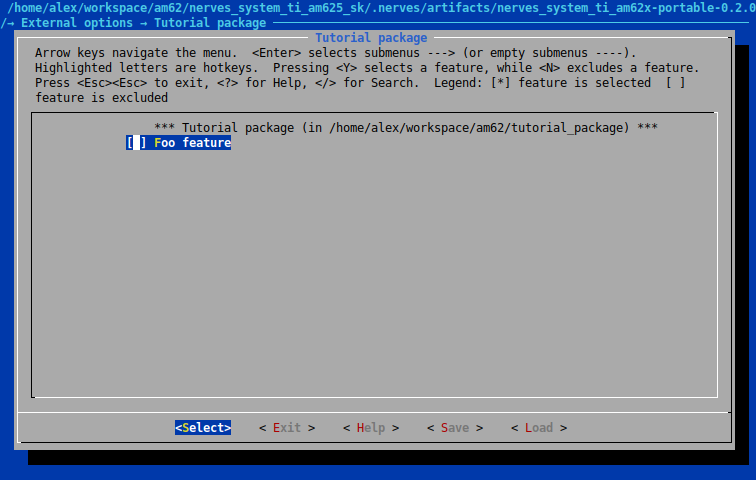

# External Buildroot Packages

Buildroot can be configured to keep customizations out of tree, and is explained in [section 9.2](https://buildroot.org/downloads/manual/manual.html#outside-br-custom) of the Buildroot manual. Normally these customizations are included with the make variable `BR2_EXTERNAL`. However, since Nerves itself is an external Buildroot package and controls the build process, this variable can't be used by Nerves systems. Instead, add the Buildroot customizations to an Elixir project and include it as a dependency in the Nerves system, with `buildroot_package: true` set in its `mix.exs` project definition. External packages are listed under `External options` in the Buildroot menuconfig.

## Create A Package

Start by creating a new Elixir project.

```bash
mix new tutorial_package
```

Open `mix.exs` and add `buildroot_package: true` to the project. This allows Nerves to detect this project as an external Buildroot package and include it in the system build.

```elixir
def project do
  [
    app: :tutorial_package,
    version: "0.1.0",
    elixir: "~> 1.16",
    buildroot_package: true,
    start_permanent: Mix.env() == :prod,
    deps: deps()
  ]
end
```

Follow the steps in [section 9.2.1](https://buildroot.org/downloads/manual/manual.html#_layout_of_a_br2_external_tree) of the Buildroot manual to set up the layout of a br2-external tree. This includes the files:
- external.desc
- external.mk
- Config.in

**external.desc**

```kconfig
name: TUTORIAL_PACKAGE
desc: Tutorial package
```

**external.mk**

```mk
include $(sort $(wildcard $(BR2_EXTERNAL_TUTORIAL_PACKAGE_PATH)/package/*/*.mk))
```
**Config.in**

```kconfig
source "$BR2_EXTERNAL_TUTORIAL_PACKAGE_PATH/package/foo/Config.in"
```

### The Package Directory

Create a directory called `package` in the project root. This is where each Buildroot package will be stored. Create a directory under it called `foo` for the new package.

In the `foo` directory, create `Config.in` and `foo.mk`.

**Config.in**

```kconfig
config BR2_PACKAGE_TUTORIAL_PACKAGE_FOO
    bool "Foo feature"
    help
      Example feature in a Nerves external Buildroot package.
```

**foo.mk**

```mk
################################################################################
#
# foo
#
################################################################################

$(eval $(generic-package))
```

### Adding The Package To The Nerves System

Navigate to the custom Nerves system that should use the external package, or clone [nerves_system_bbb](https://github.com/nerves-project/nerves_system_bbb) if you don't yet have a custom Nerves system but want to follow along with the example.

In the Nerves system's `mix.exs` file, add the `:tutorial_package` dependency.

```elixir
defp deps do
  [
    {:nerves, "~> 1.6.0 or ~> 1.7.15 or ~> 1.8", runtime: false},
    {:nerves_system_br, "1.27.3", runtime: false},
    {:nerves_toolchain_aarch64_nerves_linux_gnu, "~> 13.2.0", runtime: false},
    {:nerves_system_linter, "~> 0.4", only: [:dev, :test], runtime: false},
    {:ex_doc, "~> 0.22", only: :docs, runtime: false},
    {:tutorial_package, path: "../tutorial_package", runtime: false}
  ]
end
```

Source the package in the Nerves system's `Config.in` file. The format for the variable is `$BR2_EXTERNAL_<package>_PATH`.

```kconfig
source "$BR2_EXTERNAL_TUTORIAL_PACKAGE_PATH/Config.in"
```

Start the Nerves system compiler to create the Nerves system build artifact.

```bash
mix compile
```

For this example, stop the compilation with `Ctrl + C` after the following text appears. Instead of waiting for it to compile, we'll take a look at how Buildroot has changed.

```text
Build directory successfully created.

Configuration: /home/user/nerves_system_bbb/nerves_defconfig

Next, do the following:
   1. cd /home/user/nerves_system_bbb/.nerves/artifacts/nerves_system_bbb-portable-2.23.0
   2. make

For additional options, run 'make help' in the build directory.

IMPORTANT: If you update nerves_system_br, you should rerun this script.
```

Navigate to the Nerves system artifact directory and open Buildroot's menuconfig.

```bash
cd .nerves/artifacts/<name>
make menuconfig
```

Navigate to `External options`, `Tutorial package`. This is the menu created by the new package, and contains the `Foo feature`. Explore the [Buildroot manual](https://buildroot.org/downloads/manual/manual.html#outside-br-custom) to continue learning about creating a Buildroot package.


